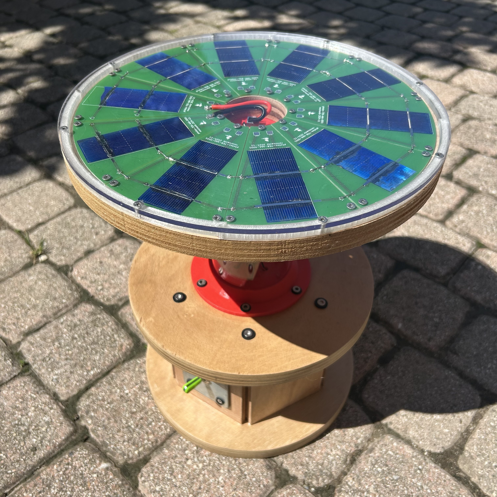
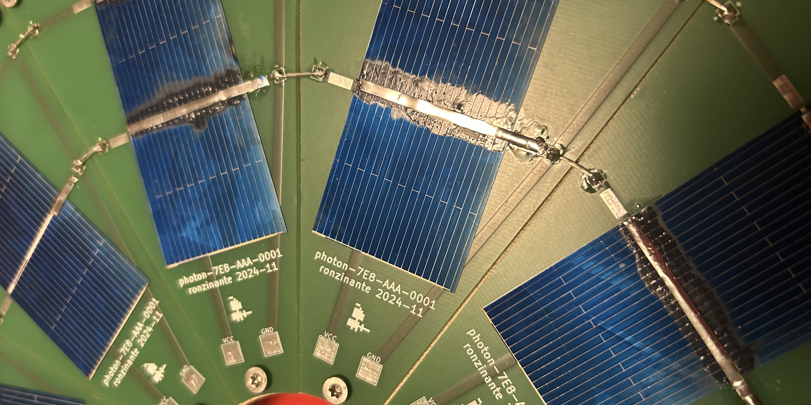
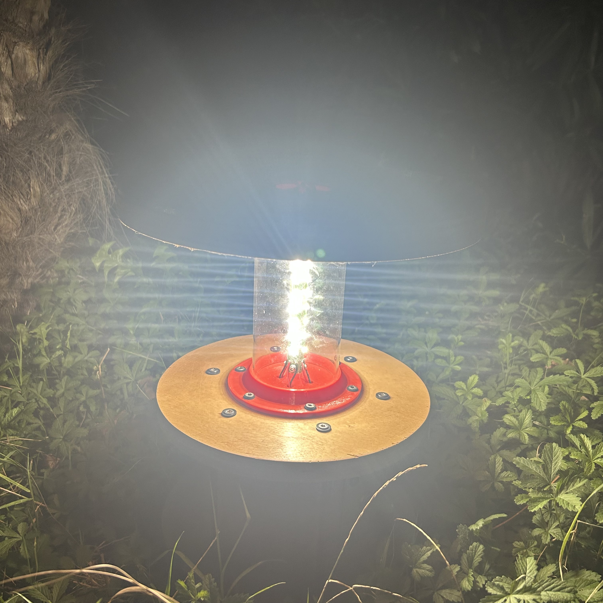

# photon emitting lantern

## Introdution

Phemla (PHoton EMitting LAntern) is a solar rechargable and not a so portable lantern. Perfect for camping activities ⛺.

## Story

The idea and the original design was developed and sketched by a Scout group.

## Goals

Make this project as much open source possible, starting from CAD to CAE files.

Design wins:

- Overall part count is very low
- The parts are easy to fabricate (possible machining processes)
- The machine is easy to assemble
- Maximizing usage of materials like glass and wood

## Iterations history

### Mark 1

First version. It was used a power bank with usb-c for recharging purpouse and usb-a for withdraw necessary output for the LEDs. Solar cells are not used in this stage.

*Internals*

*Particular is visible the power bank*

*Mark 1 - Turned on*

### Mark 2

Improved version. It was added a solar module.

### Mark 3

Still in under development.

## Design FIles

| Iteration   | ZIP files              |
| ----------- | -----------            |
| Mark 1      | work in progress   |
| Mark 2      | work in progress   |
| Mark 3      | work in progress   |

## To do

- Add design files
Reduce number of screws
- Improve plexiglass fixing or laternative solutions
- Use standard 5mm LEDs instead of using SMD components (more user-friendly)
- Rotate 90° usbc feedthrough
- Reduce costs (mostly derivative by PCB design)
- Reduce overall dimensions
